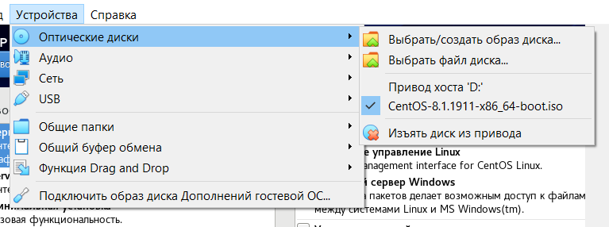

**РОССИЙСКИЙ УНИВЕРСИТЕТ ДРУЖБЫ НАРОДОВ**

**Факультет физико-математических и естественных наук**

**Кафедра прикладной информатики и теории вероятностей**

**ОТЧЕТ** 

**ПО ЛАБОРАТОРНОЙ РАБОТЕ № 	1**

*дисциплина:	Операционные системы*		 

Студент: Понкратова Христина Анатольевна                                 

`	`Группа: НПМбд-02-20                                       

**МОСКВА**

2021 г.

1. Запускаю виртуальную машину и перехожу к настройкам установки операционной системы

1. Начальный этап установки Virtual Box

\3. Запускаю  виртуальную машину. Проверяю в свойствах VirtualBox месторасположение каталога для виртуальных машин. 

\4. Создаю новую виртуальную машину

\5. Приступаю к настройке. Указываю имя виртуальной машины (kaponkratova), тип операционной системы — Linux, RedHat. 

` `Указываю размер основной памяти виртуальной машины — 1024 МБ. Задаю конфигурацию жёсткого диска — загрузочный, VDI (BirtualBox Disk Image)

` `и динамический виртуальный диск

Задаю размер диска — 20 ГБ (или больше), его расположение — в данном случае такое как на скрине.

` `

\6. Выбираю в VirtualBox Свойства Носители Вашей виртуальной машины. Добавляю новый привод оптических дисков и выбираю образ CentOS-7-x86\_64-DVD.iso. При установке использовала скачанный образ операционной системы CentOS. Запускаю виртуальную машину, выбираю язык интерфейса и перехожу к настройкам установки операционной системы. Также корректирую часовой пояс, раскладку клавиатуры 

\7. Отключаю KDUMP. Место установки ОС оставляю без изменения. Включаю сетевое соединение. Устанавливаю пароль для root и пользователя с правами администратора. После завершения установки операционной системы корректно перезапускаю виртуальную машину и принимаю условия лицензии.

ее я отключаю

\8. Вхожу в ОС под заданной при установке учётной записью. В меню Устройства виртуальной машины подключаю образ диска дополнений гостевой ОС, при необходимости ввожу пароль пользователя root виртуальной ОС.

Вывод: В процессе работы приобрела практические навыки установки операционной системы на виртуальную машину, настройки минимально необходимых для дальнейшей работы сервисов. Также научилась пользоваться консолью в целях получения информации об установленном ос. Вспомнила необходимые для работы с терминалом линукса команды. 
