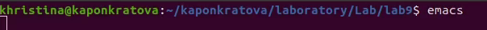
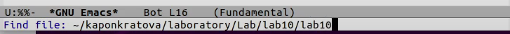

**РОССИЙСКИЙ УНИВЕРСИТЕТ ДРУЖБЫ НАРОДОВ**

**Факультет физико-математических и естественных наук**

**Кафедра прикладной информатики и теории вероятностей**

**ОТЧЕТ** 

**ПО ЛАБОРАТОРНОЙ РАБОТЕ № 	10**

*дисциплина:	Операционные системы*		 

Студент: Понкратова Христина Анатольевна

`	`Группа: НПМбд-02-20                                       

**МОСКВА**

2020 г.
# Цель работы:
Познакомиться с операционной системой Linux. Получить практические навыки работы с редактором Emacs.
# Ход работы:
1. Открыли emacs. 

1. Создали файл lab10.sh с помощью комбинации Ctrl-x Ctrl-f (C-x C-f). 

1. Набрали текст: 

#!/bin/bash

HELL=Hello 

function hello { 

LOCAL HELLO=World 

echo $HELLO

} 

echo $HELLO 

hello

1. Сохранили файл с помощью комбинации Ctrl-x Ctrl-s (C-x C-s). 
1. Проделали с текстом стандартные процедуры редактирования, осуществляя каждое действие комбинацией клавиш. 
   1. Вырезали одной командой целую строку (С-k). 
   1. Вставили эту строку в конец файла (C-y). 
   1. Выделили область текста (C-space). 
   1. Скопировали область в буфер обмена (M-w). 
   1. Вставили область в конец файла. 
   1. Вновь выделили эту область и на этот раз вырезали её (C-w). 
   1. Отменили последнее действие (C-/). 

1. Научились использовать команды по перемещению курсора. 
   1. Переместили курсор в начало строки (C-a). 
   1. Переместили курсор в конец строки (C-e). 
   1. Переместили курсор в начало буфера (M-). 
   1. Переместили курсор в конец буфера (M->).

1. Ознакомились с управлением буферами. 
   1. Вынесли список активных буферов на экран (C-x C-b). 

1. Переместились во вновь открытое окно (C-x) o со списком открытых буферов и переключились на другой буфер. 
1. Закрыли это окно (C-x 0). 
1. Теперь вновь переключились между буферами, но уже без вывода их списка на экран (C-x b). 

1. Ознакомились с управлением окнами. 
   1. Поделили фрейм на 4 части: разделили фрейм на два окна по вертикали (C-x 3), а затем каждое из этих окон на две части по горизонтали (C-x 2).

1. В каждом из четырёх созданных окон открыли новый буфер (файл) и ввели несколько строк текста.

1. Ознакомились с режимом поиска. 
   1. Переключились в режим поиска (C-s) и нашли несколько слов, присутствующих в тексте. 

1. Переключились между результатами поиска, нажимая C-s. 

1. Вышли из режима поиска, нажав C-g. 
1. Перешли в режим поиска и замены (M-%), ввели текст, который следует найти и заменить, нажали Enter, затем ввели текст для замены. После того как подсветились результаты поиска, нажали ! для подтверждения замены. 

1. Испробуйте другой режим поиска, нажав M-s o. В обычном режиме результатом поиска будут выделенные цветом слова, в то время как в данном режиме при первом совпадении заданного в поиске слова и слова в тексте, курсор остановиться разу поле слова в тексте. 

# Вывод:
В ходе работы мы подробнее познакомились с операционной системой Linux, а также получили практические навыки работы с редактором Emacs.
# Ответы на контрольные вопросы:
1. Краткая характеристика редактора: Emacs представляет собой мощный экранный редактор текста, написанный на языке высокого уровня Elisp.
1. Для работы с emacs используется система меню и комбинаций клавиш. Используются сочетания c клавишами <ctrl> и <meta>. Сложности могут возникнуть так как на клавиатуре для IBM PC совместимых ПК клавиши <meta> нет, то вместо нее можно использовать <alt> или <esc>\verb . Для доступа к системе меню используйте клавишу F10.
1. В терминологии emacs’а буфер- это область где мы набираем текст, а окно область, которая объединяет открытые буферы.
1. Можно открыть больше 10 буферов в одном окне.
1. Создаются по умолчанию при запуске emacs:

% \*GNU Emacs\* 844 Fundamental 

\*scratch\* 191 Lisp Interaction 

%\* \*Messages\* 5257 Messages 

% \*Quail Completions\* 0 Fundamental

1. Клавиши: Ctrl,C,Shift,\,] и <esc>,Ctrl,C Ctrl,Shift,\,]
1. Разделите фрейм на два окна по вертикали C-x-3, окно на две части по горизонтали C-x-2
1. В файле Emacs хранятся настройки редактора emacs.
1. Кнопка backspace (стереть букву) = функции C-k и ее можно переназначить.
1. Emacs оказался намного удобнее. В нём больше функций, в нём интересно редактировать информацию.

