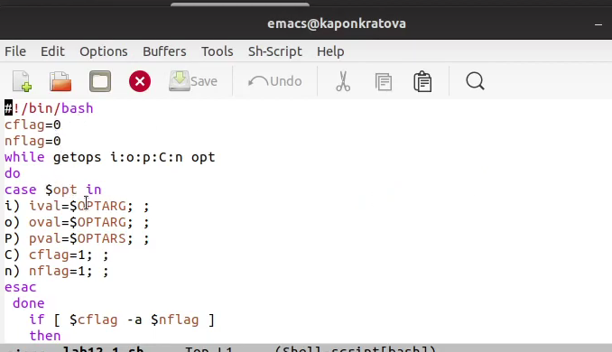
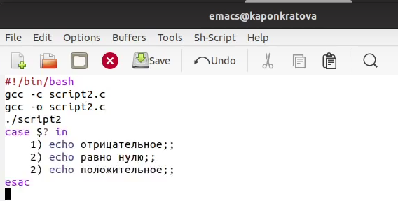
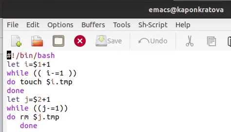
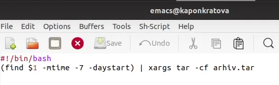

**РОССИЙСКИЙ УНИВЕРСИТЕТ ДРУЖБЫ НАРОДОВ**

**Факультет физико-математических и естественных наук**

**Кафедра прикладной информатики и теории вероятностей**

**ОТЧЕТ** 

**ПО ЛАБОРАТОРНОЙ РАБОТЕ № 12**

*дисциплина:	Операционные системы*		 

Студент:   Понкратова Христина Анатольевна                                  

`	`Группа: НПМбд-02-20                                      

**МОСКВА**

2021 г.
# Цель работы
Изучить основы программирования в оболочке ОС UNIX. Научится писать более сложные командные файлы с использованием логических управляющих конструкций и циклов.
# `	`Выполнение лабораторной работы
1. Используя команды getopts grep напишем командный файл, который анализирует командную строку с ключами и выполним его: -i inputfile — прочитать данные из указанного файла; -o outputfile — вывести данные в указанный файл; -p шаблон — указать шаблон для поиска; -C — различать большие и малые буквы; -n — выдавать номера строк;

а затем ищет в указанном файле нужные строки

2. Напишем сначала на языке Си программу, которая вводит число и определяет, является ли оно больше нуля, меньше нуля или равно нулю. Затем завершим программу при помощи функции exit(n), передавая информацию о коде завершения в оболочку. Командный файл вызовет эту программу и, проанализировав с помощью команды $?, выдаст сообщение о том, какое число было введено

3. Напишем командный файл, создающий указанное число файлов, пронумерованных последовательно от 1 до N

4. Напишем командный файл, который с помощью команды tar запаковывает в архив все файлы в указанной директории. Модифицируем его так, чтобы запаковывались только те файлы, которые были изменены менее недели тому назад.

# `	`Вывод
В данной работе мы изучили основы программирования в оболочке ОС UNIX и писать более сложные командные файлы с использованием логических управляющих конструкций и циклов.
# `	`Контрольные вопросы
1. Каково предназначение команды getopts? Ответ: Создание по пользовательским аргументам.
1. Какое отношение метасимволы имеют к генерации имён файлов? Ответ: Используют как файлы так и аргументы.
1. Какие операторы управления действиями вы знаете? Ответ: If, else, elif, fi, while, do, done, until, do, done, for, in, do, done, case, in, esac
1. Какие операторы используются для прерывания цикла? Ответ:
1. for – будет выполнять действие до тех пор, пока есть объекты для выполнения.
1. while – выполняет действие до тех пор, пока условие является истинным.
1. until – будет выполнятся пока условие не станет правдиво.
1. Для чего нужны команды false и true? Ответ: until – будет выполняться до тех пор, пока условие не станет true, т.е. пока оно не станет false.
1. Что означает строка if test -f mans/i.$s, встреченная в командном файле? Ответ: Проверяет если существует файл его размерность и тип c двумя разными расширениями, заменяя через переменные.
1. Объясните различия между конструкциями while и until. Ответ:
   while – выполняет действие до тех пор, пока условие является истинным.
   until – будет выполняться до тех пор, пока условие не станет истинным, т.е. пока оно false
