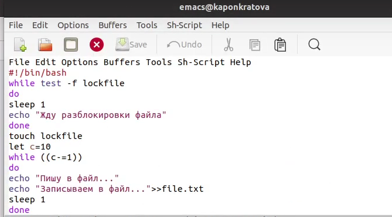
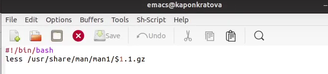
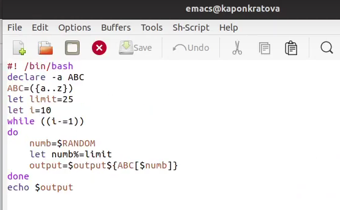

**РОССИЙСКИЙ УНИВЕРСИТЕТ ДРУЖБЫ НАРОДОВ**

**Факультет физико-математических и естественных наук**

**Кафедра прикладной информатики и теории вероятностей**

**ОТЧЕТ** 

**ПО ЛАБОРАТОРНОЙ РАБОТЕ № 	13**

*дисциплина:	Операционные системы*		 

Студент: Понкратова Христина Анатольевна                                   

`	`Группа: НПМбд-02-20                                      

**МОСКВА**

2021 г.

Цель работы:

Изучить основы программирования в оболочке ОС UNIX. Научиться писать более сложные командные файлы с использованием логических управляющих конструкций и циклов.

Ход работы:

1. Осуществили вход в систему, создали текстовый документ, затем перешли в него. Написали командный файл, реализующий упрощённый механизм семафоров. Командный файл в течение некоторого времени t1 дожидается освобождения ресурса, выдавая об этом сообщение, а дождавшись его освобождения, использует его в течение некоторого времени t2<>t1, также выдавая информацию о том, что ресурс используется соответствующим командным файлом (процессом). Запустили командный файл в одном виртуальном терминале в фоновом режиме, перенаправив его вывод в другой, в котором также запущен этот файл, но не фоновом, а в привилегированном режиме. Доработали программу так, чтобы имелась возможность взаимодействия трёх и более процессов.

1. Реализовали команду man с помощью командного файла. Изучили содержимое каталога /usr/share/man/man1. В нем находятся архивы текстовых файлов, содержащих справку по большинству установленных в системе программ и команд. Каждый архив можно открыть командой less сразу же просмотрев содержимое справки. Командный файл должен получать в виде аргумента командной строки название команды и в виде результата выдавать справку об этой команде или сообщение об отсутствии справки, если соответствующего файла нет в каталоге man1.

1. Используя встроенную переменную $RANDOM, напиали командный файл, генерирующий случайную последовательность букв латинского алфавита. 

Вывод:

Мы изучили основы программирования в оболочке ОС UNIX, а также научились писать более сложные командные файлы с использованием логических управляющих конструкций и циклов.

Ответы на контрольные вопросы:

1. В строке while [$1 != "exit"] $1 следует внести в кавычки(«»).
1. С помощью знака >,|можно объединить несколько строк в одну.
1. Эта утилита выводит последовательность целых чисел с заданным шагом. Также можно реализовать с помощью утилиты jot.
1. Результатом вычисления выражения $((10/3)) будет число 3.
1. В zsh можно настроить отдельные сочетания клавиш так, как вам нравится. Использование истории команд в zsh ничем особенным не отличается от bash. Zsh очень удобен для повседневной работы и делает добрую половину рутины за вас. Но стоит обратить внимание на различия между этими двумя оболочками. Например, в zsh после for обязательно вставлять пробел, нумерация массивов в zsh начинается с 1, чего совершенно невозможно понять. Так, если вы используете shell для повседневной работы, исключающей написание скриптов, используйте zsh. Если вам часто приходится писать свои скрипты, только bash! Впрочем, можно комбинировать.
1. Синтаксис конструкции for ((a=1; a <= LIMIT; a++)) верен.
1. Язык bash и другие языки программирования:
   1. Скорость работы программ на ассемблере может быть более 50% медленнее, чем программ на си/си++, скомпилированных с максимальной оптимизацией;
   1. Скорость работы виртуальной ява-машины с байт-кодом часто превосходит скорость аппаратуры с кодами, получаемыми трансляторами с языков высокого уровня. Ява-машина уступает по скорости только ассемблеру и лучшим оптимизирующим трансляторам;
   1. Скорость компиляции и исполнения программ на яваскрипт в популярных браузерах лишь в 2-3 раза уступает лучшим трансляторам и превосходит даже некоторые качественные компиляторы, безусловно намного (более чем в 10 раз) обгоняя большинство трансляторов других языков сценариев и подобных им по скорости исполнения программ;
   1. Скорость кодов, генерируемых компилятором языка си фирмы Intel, оказалась заметно меньшей, чем компилятора GNU и иногда LLVM;
   1. Скорость ассемблерных кодов x86-64 может меньше, чем аналогичных кодов x86, примерно на 10%;
   1. Оптимизация кодов лучше работает на процессоре Intel;
   1. Скорость исполнения на процессоре Intel была почти всегда выше, за исключением языков лисп, эрланг, аук (gawk, mawk) и бэш. Разница в скорости по бэш скорее всего вызвана разными настройками окружения на тестируемых системах, а не собственно транслятором или железом. Преимущество Intel особенно заметно на 32-разрядных кодах;
   1. Стек большинства тестируемых языков, в частности, ява и яваскрипт, поддерживают только очень ограниченное число рекурсивных вызовов. Некоторые трансляторы (gcc, icc, ...) позволяют увеличить размер стека изменением переменных среды исполнения или параметром;
   1. В рассматриваемых версиях gawk, php, perl, bash реализован динамический стек, позволяющий использовать всю память компьютера. Но perl и, особенно, bash используют стек настолько экстенсивно, что 8-16 ГБ не хватает для расчета ack(5,2,3)

