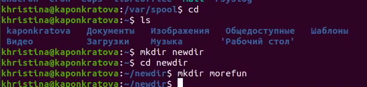
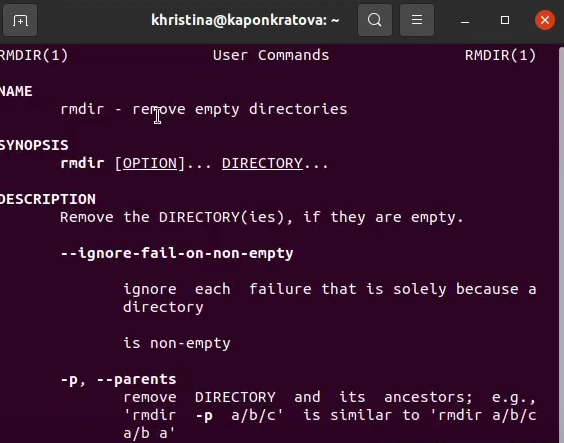

**РОССИЙСКИЙ УНИВЕРСИТЕТ ДРУЖБЫ НАРОДОВ**

**Факультет физико-математических и естественных наук**

**Кафедра прикладной информатики и теории вероятностей**

**ОТЧЕТ** 

**ПО ЛАБОРАТОРНОЙ РАБОТЕ № 	5**

*дисциплина:	Операционные системы*		 

Студент: Понкратова Христина Анатольевна                                    

`	`Группа: НПМбд-02-20                                       

**МОСКВА**

2021 г.

\1. Определяю полное имя нашего домашнего каталога.

2.1. Перехожу в каталог /tmp.

2.2. Вывожу на экран содержимое каталога /tmp. Для этого используем ко-

манду ls с различными опциями. Поясняю разницу в выводимой на экран

информации.

2.3. Определяю, есть ли в каталоге /var/spool подкаталог с именем cron

3.1. В домашнем каталоге создаю новый каталог с именем newdir.

3.2. В каталоге ~/newdir создаю новый каталог с именем morefun

3.3. В домашнем каталоге создаю одной командой три новых каталога с име-

нами letters, memos, misk. Затем удаляю эти каталоги одной командой.

3.4. Пробую удалить ранее созданный каталог ~/newdir командой rm. Каталог не был удален

3.5. Удаляю каталог ~/newdir/morefun из домашнего каталога. Проверяю,

был ли каталог удалён.

\4. С помощью команды man определяю, какую опцию команды ls нужно исполь-

зовать для просмотра содержимое не только указанного каталога, но и подката-

логов, входящих в него.

\5. С помощью команды man определяю набор опций команды ls, позволяющий от-

сортировать по времени последнего изменения выводимый список содержимого

каталога с развёрнутым описанием файлов.

\6. Использую команду man для просмотра описания следующих команд: cd, pwd,

mkdir, rmdir, rm. Поясняю основные опции этих команд.

\7. Используя информацию, полученную при помощи команды history, выполняю

модификацию и исполнение нескольких команд из буфера команд

Вывод: в ходе работы я приобрела практические навыки взаимодействия пользователя с системой посредством командной строки.

