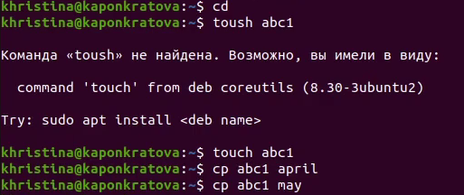
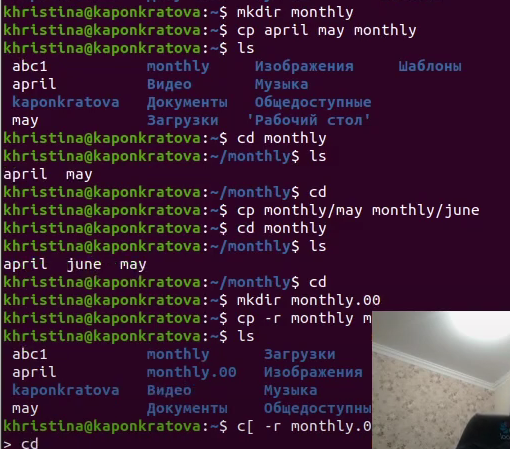
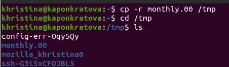
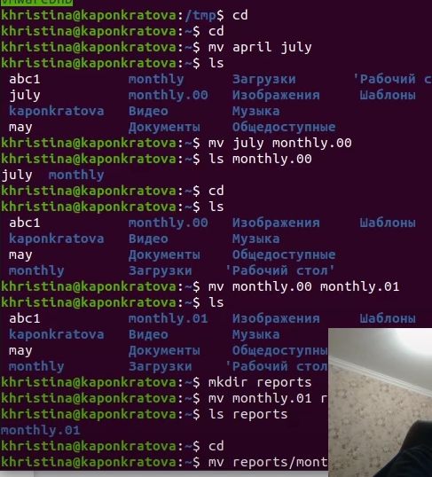
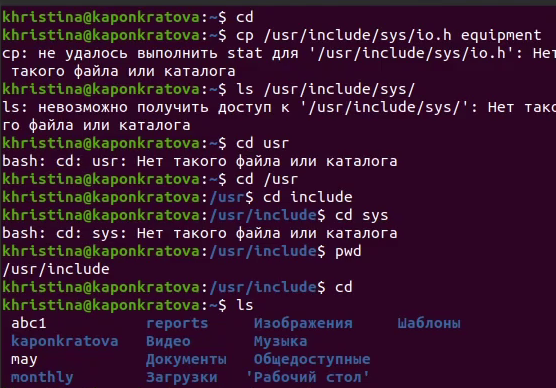
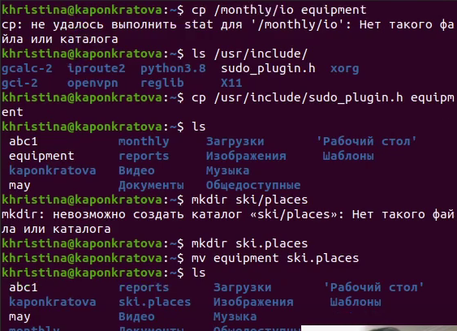
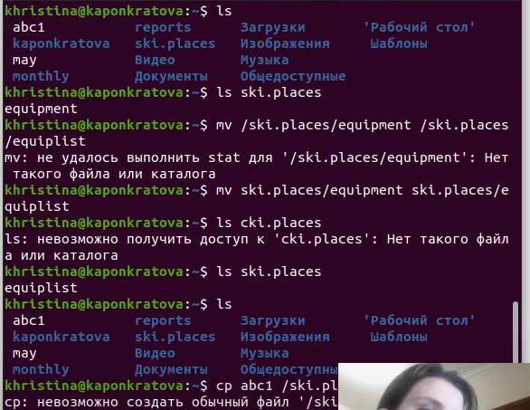
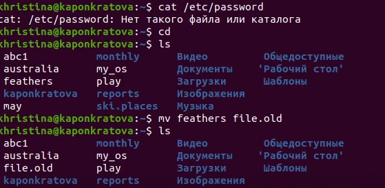
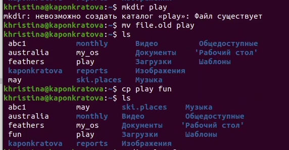
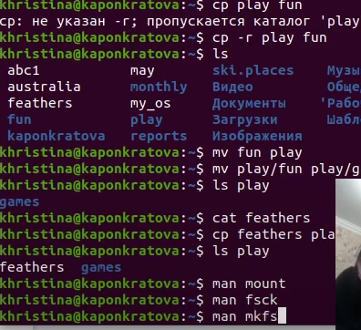


**РОССИЙСКИЙ УНИВЕРСИТЕТ ДРУЖБЫ НАРОДОВ**

**Факультет физико-математических и естественных наук**

**Кафедра прикладной информатики и теории вероятностей**

**ОТЧЕТ**

**ПО ЛАБОРАТОРНОЙ РАБОТЕ № 6**

*дисциплина: Операционные системы*

Студент: Понкратова Христина Анатольевна

Группа: НПМбд-02-20

МОСКВА

2021 г.

**Цель работы:**

Ознакомиться с файловой системой Linux, её структурой, именами и содержанием каталогов. Приобрети практические навыки по применению команд для работы с файлами и каталогами, по управлению процессами (и работами), по проверке использования диска и обслуживанию файловой системы.

Ход работы:

\1. Выполняю все примеры, приведённые в первой части описания лабораторной работы.

\2. Выполняю следующие действия:

a. Копирую файл /usr/include/sys/io.h в домашний каталог и назвали его equipment.

b. В домашнем каталоге создаю директорию ~/ski.plases.

c. Перемещаю файл equipment в каталог ~/ski.plases.

d. Переименовываю файл ~/ski.plases/equipment в ~/ski.plases/equiplist.

e. Создаю в домашнем каталоге файл abc1 и скопировали его в каталог ~/ski.plases, называю его equiplist2.

f. Создаю каталог с именем equipment в каталоге ~/ski.plases.

g. Перемещаю файлы ~/ski.plases/equiplist и equiplist2 в каталог ~/ski.plases/equipment.

h. Создаю и перемещаю каталог ~/newdir в каталог ~/ski.plases и называю его plans.

\3. Определяю опции команды chmod, необходимые для того, чтобы присвоить файлам australia, play, my\_os и feathers следующие права доступа соответственно, считая, что в начале таких прав нет: drwxr--r--, drwx--x—x, -r-xr--r--, -rw-rw-r--.

\4. Проделываю следующие упражнения:

a. Просматриваю содержимое файла /etc/password.

b. Копирую файл ~/feathers в файл ~/file.old.

c. Перемещаю файл ~/file.old в каталог ~/play.

d. Копирую каталог ~/play в каталог ~/fun.

 

e. Перемещаю каталог ~/fun в каталог ~/play и называю его games.

f. Лишаю владельца файла ~/feathers права на чтение.

g.Пытаюсь просмотреть файл ~/feathers командой cat. Из-за лишения права на чтение, сделать этого не получается.

h. Пытаюсь скопировать файл ~/feathers. Из-за лишения права на чтение, сделать этого не получилось.

i. Даю владельцу файла ~/feathers право на чтение.

j. Лишаю владельца каталога ~/play права на выполнение.

k. Перехожу в каталог ~/play. Ничего не изменилось, так как мы не запускали каталог, а перешли в него, однако сама иконка каталога изменилась.

l. Даем владельцу каталога ~/play право на выполнение.

\5. Прочитаем man по командам mount, fsck, mkfs, kill.

a. mount - нужна для просмотра смонтированных файловых систем, а также для монтирования любых локальных или удаленных файловых систем. Например, при вызове команды «mount /dev/cdrom /mnt/cdrom» устройство /dev/cdrom монтируется в каталог /mnt/cdrom, если он существует. Начиная от момента монтирования и пока пользователь не отмонтирует файловую систему (или туда не будет смонтировано что-то иное) в каталоге /mnt/cdrom будет содержаться дерево каталогов устройства /dev/cdrom; те файлы, и подкаталоги, которые раньше находились в /mnt/cdrom, сохранятся, но будут недоступны до

размонтирования устройства /dev/cdrom. Для размонтирования достаточно указать точку монтирования или имя устройства, команда «umount /dev/cdrom». При запуске команды mount без параметров выводится список смонтированных файловых систем.

b. fsck - fsck [ -sAVRTNP ] [ -C [ fd ] ] [ -t fstype ] [filesys … ] [--] [ fs-specific-options ] - проверяет и устраняет ошибки в файловой системе. Например, fsck -fy -t ext4 /dev/sda1. Опция -f (force) используется для принудительного выполнения проверки. Опция -y (yes) позволяет программе автоматически отвечать "да" на все вопросы в ходе работы.

c. mkfs - действие заключается в создании указанной файловой системы на выбранном диске или разделе. Например, команда «mkfs-text2 /dev/hda1» создает файловую систему ext2 на разделе hda1.

d. kill - kill [ -s сигнал | -p ] [ -a ] pid - kill -l [ сигнал ] - завершает некорректно работающее приложение. Например, чтобы послать сигнал SIGKILL (он имеет номер 9) процессу 2811, необходимо вызвать команду «kill -9 2811».

**Вывод:**

В ходе работы мы ознакомились с файловой системой Linux, а также приобрели практические навыки по применению команд для работы с файлами и каталогами, по управлению процессами, по проверке использования диска и обслуживанию файловой системы.

**Ответы на контрольные вопросы:**

\1) На моем ноутбуке:

Ext4 - журналируемая файловая система, используемая в ОС на ядре Linux. Основана на файловой системе Ext3, но отличается тем, что в ней представлен механизм записи файлов в непрерывные участки блоков (екстенты), уменьшающий фрагментацию и повышающий производительность.

\2) Файловая система в дисплейном классе содержит следующие каталоги первого уровня:

· /bin - Основные программы, необходимые для работы в системе: командные оболочки shell, основные утилиты.

· /boot - Каталог, который содержит ядро системы— главную программу, загружающую и исполняющую все остальные.

· /dev - Каталог, в котором содержатся псевдофайлы устройств. С точки зрения Linux все физические устройства, как главные, так и периферийные, представляют собой файлы особого типа, в которые система может записывать данные и из которых она может их считывать. Пользователь не должен работать с этими файлами, поскольку запись неправильных данных в файл устройства может повредить устройство или хранящиеся на нём данные.

· /etc - В этом каталоге содержатся системные конфигурационные файлы — текстовые файлы, которые считываются при загрузке системы и запуске программ и определяют их поведение. Настройка и администрирование Linux в конечном итоге сводится к редактированию этих файлов, даже если оно выполняется при помощи графических средств конфигурирования системы.

· /home - В структуре файловой системы Linux каждый пользователь имеет отдельный личный каталог для своих данных (т.н. домашний каталог), и все пользовательские каталоги выделены в отдельный общий каталог /home.

· /mnt - Каталоги для монтирования файловых систем сменных устройств и внешних файловых систем.

· /proc - Файловая система на виртуальном устройстве, её файлы содержат информацию о текущем состоянии системы.

· /root - Каталог администратора системы.

· /sbin - Системные утилиты.

· /usr - Программы и библиотеки, доступные пользователю.

· /var - Рабочие файлы программ, различные временные данные: очереди (письма на отправку, файлы на печать и др.), системные журналы (файлы, в которые записывается информация о происходящих в системе событиях).

· /tmp - Временные файлы.

\3. Какая операция должна быть выполнена, чтобы содержимое некоторой файловой системы было доступно операционной системе? 

Для того чтобы содержимое некоторой файловой системы было доступно операционной системе, необходимо выполнить команду mount.

\4. Назовите основные причины нарушения целостности файловой системы. Как устранить повреждения файловой системы? 

Некорректность файловой системы может возникать не только в результате насильственного прерывания операций ввода-вывода, выполняемых непосредственно с диском, но и в результате нарушения работы дискового кэша. Кэширование данных с диска предполагает, что в течение некоторого времени результаты операций ввода-вывода никак не сказываются на содержимом диска — все изменения происходят с копиями блоков диска, временно хранящихся в буферах оперативной памяти. В этих буферах оседают данные из пользовательских файлов и служебная информация файловой системы, такая как каталоги, индексные дескрипторы, списки свободных, занятых и поврежденных блоков и т. п.

\5. Как создаётся файловая система?

Разбитие диска на разделы и создание ФС в Linux делается при помощи специальных утилит – cfdisk fdisk sfdisk mke2fs mkfs mkfs.ext2 mkfs.ext3 mkfs.ext4 mkswap partimage parted указывая им в качестве аргумента конкретное блочное устройство (/dev/\*\*\*). Блочные устройства HDD вида /dev/sda можно использовать целиком для единственной ФС, но это редко применяется на практике. Лучше разделить все пространство на разделы меньшего размера и использовать их под разные задачи.

\6. Дайте характеристику командам, которые позволяют просмотреть текстовые файлы. 

Для просмотра небольших файлов удобно пользоваться командой cat.

Формат команды: cat имя-файла Для просмотра больших файлов используйте команду less — она позволяет осуществлять постраничный просмотр файлов (длина страницы соответствует размеру экрана). Формат команды: less имя-файла Для управления процессом просмотра вы можете использовать следующие управляющие клавиши: Пробел → переход на следующую страницу, ENTER → сдвиг вперед на одну строку, b → возврат на предыдущую страницу, h → обращение за подсказкой, q → выход в режим командной строки. Для просмотра начала файла вы можете воспользоваться командой head. По умолчанию она выводит первые 10 строк файла.

\7. Приведите основные возможности команды cp в Linux. 

Копирование файлов и каталогов осуществляется при помощи команды cp. Формат команды: cp[-опции] исходный\_файл целевой\_файл. Опция i в команде cp поможет избежать уничтожения информации в случае, если на место целевого файла вы поставите имя уже существующего файла: система попросит подтвердить, что вы хотите перезаписать этот файл. Команда cp с опцией r (recursive) позволяет копировать каталоги вместе с входящими в них файлами и каталогами

\8. Назовите и дайте характеристику командам перемещения и переименования файлов и каталогов. 

Команды mv и mvdir предназначены для перемещения и переименования файлов и каталогов. Формат команды: mv [-опции] старый\_файл новый\_файл. Для получения предупреждения перед переписыванием файла стоит использовать опцию i.

\9. Что такое права доступа? Как они могут быть изменены? При ответах на вопросы используйте дополнительные источники информации по теме.

Права доступа определяют, кто и что может делать с содержимым файла. Существуют три группы прав доступа: для владельца файла, для членов группы, для всех остальных Для изменения прав доступа к файлу или каталогу используется команда chmod. Права доступа к файлу может поменять только владелец или суперпользователь (администратор). Формат команды: chmod режим имя\_файла. Режим (в формате команды) имеет следующую структуру и способ записи:

· = установить право;

· - лишить права;

· + дать право;

· r чтение;

· w запись;

· x выполнение;

· u (user) владелец файла;

· g (group) группа, к которой принадлежит владелец файла;

· (others) все остальные.

