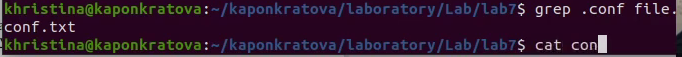
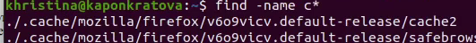
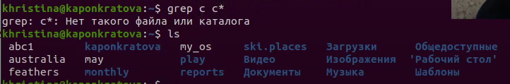
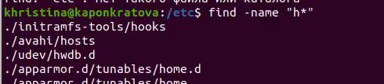
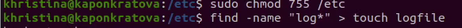
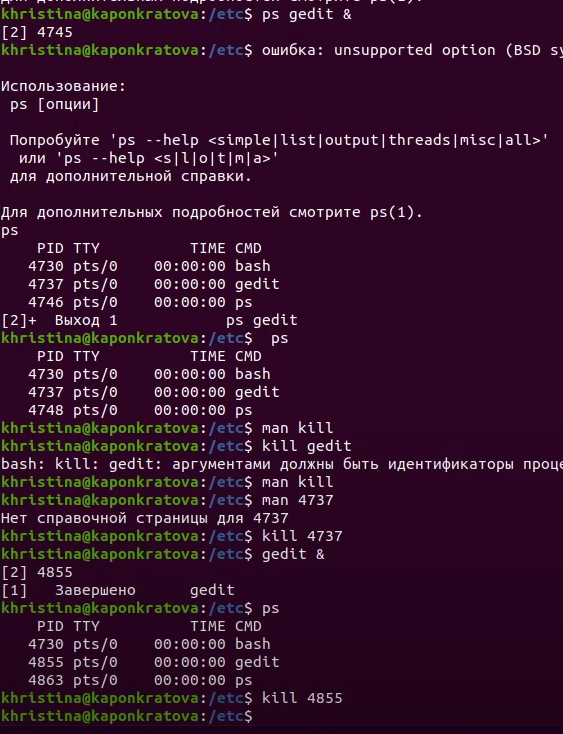
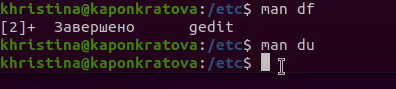
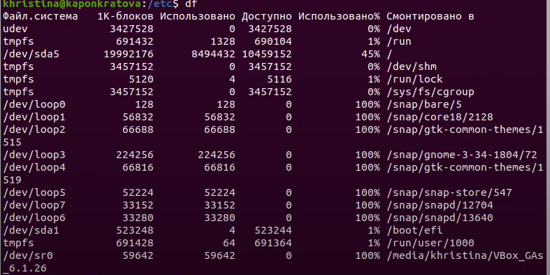
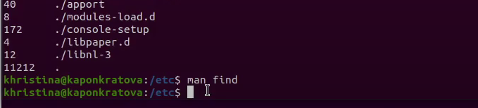


**РОССИЙСКИЙ УНИВЕРСИТЕТ ДРУЖБЫ НАРОДОВ**

**Факультет физико-математических и естественных наук**

**Кафедра прикладной информатики и теории вероятностей**

**ОТЧЕТ**

**ПО ЛАБОРАТОРНОЙ РАБОТЕ № 7**

*дисциплина: Операционные системы*

Студент: Понкратова Христина Анатольевна

Группа: НПМбд-02-20

МОСКВА

2021 г.

Цель работы:

Ознакомление с инструментами поиска файлов и фильтрации текстовых данных. Приобретение практических навыков: по управлению процессами, по проверке использования диска и обслуживанию файловых систем.

Ход работы:

1 Включаем компьютер, и заходим в учетную запись.

2 Запишем в файл file.txt названия файлов, содержащихся в каталоге /etc. Допишем в этот же файл названия файлов, содержащихся в нашем домашнем каталоге.

3 Выведем имена всех файлов из file.txt, имеющих расширение .conf, после чего запишем их в новый текстовой файл conf.txt.

4 Определили, какие файлы в нашем домашнем каталоге имеют имена, начинавшиеся с символа c?

5 Выведем на экран (постранично) имена файлов из каталога /etc, начинающиеся с символа h.

find  -name "h\*" 

6 Запустили в фоновом режиме процесс, который будет записывать в файл ~/logfile файлы, имена которых начинаются с log. Процесс выполнен

7 Удалили файл ~/logfile. Но сначала убили процесс в нем.

8 Запустили из консоли в фоновом режиме редактор gedit.

9 Определили идентификатор процесса gedit, используя команду ps, конвейер и фильтр grep

10 Прочитали справку (man) команды kill, после чего используйте её для завершения процесса gedit.

11 Выполним команды df и du, предварительно получив более подробную информацию об этих командах, с помощью команды man.

12 Воспользовавшись справкой команды find, вывести имена всех директорий, имеющихся в нашем домашнем каталоге.

find ~ -type d

Вывод

В данной работе мы ознакомились с инструментами поиска файлов и фильтрации текстовых данных. А также приобрели практические навыки по управлению процессами.

`	`Контрольные вопросы

1. Какие потоки ввода вывода вы знаете? Ответ:
1) stdin — стандартный поток ввода (клавиатура),
1) stdout — стандартный поток вывода (консоль),
1) stderr — стандартный поток вывод сообщений об ошибках на экран
2. Объясните разницу между операцией > и >> Ответ: Разница заключается в том, что Символ > используется для переназначения стандартного ввода команды, а символ >> используется для присоединения данных в конец файла стандартного вывода команды.
2. Что такое конвейер? Ответ: Конвейер – это способ связи между двумя программами. Например: конвейер pipe служит для объединения простых команд или утилит в цепочки, в которых результат работы предыдущей команды передается последующей. Синтаксис у конвейера следующий: команда1 | команда 2
2. Что такое процесс? Чем это понятие отличается от программы? Ответ: Процесс - это программа, которая выполняется в отдельном виртуальном адресном пространстве независимо от других программ или их пользованию по необходимости.
2. Что такое PID и GID? Ответ: Во первых id — UNIX-утилита, выводящая информацию об указанном пользователе USERNAME или текущем пользователе, который запустил данную команду и не указал явно имя пользователя.
1) GID – (Group ID) - идентификатор группы
1) UID – (User ID) - идентификатор группы Обычно UID является — положительным целым число м в диапазоне от 0 до 65535, по которому в системе однозначно отслеживаются действия пользователя
6. Что такое задачи и какая команда позволяет ими управлять? Ответ: Запущенные фоном программы называются задачами(процессами) (jobs). Ими можно управлять с помощью команды jobs, которая выводит список запущенных в данный момент процессов. Для завершения процесса необходимо выполнить команду : kill % номер задачи
6. Найдите информацию об утилитах top и htop. Каковы их функции? Ответ: Top это консольная команда, которая выводит список работающих в системе процессов и информации о них. По умолчанию она в реальном времени сортирует их по нагрузке на процессор.Htop же является альтернативой программы top она предназначенная для вывода на терминал списка запущенных процессов и информации о них.
6. Назовите и дайте характеристику команде поиска файлов. Приведите примеры использования этой команды. Ответ: Команда find используется для поиска и отображения имен файлов, соответствующих заданной строке символов. Синтаксис: find trek [-options] Пример: Задача - Вывести на экран имена файлов из каталога /etc и его подкаталогов, Заканчивающихся на k: find ~ -name "\*k" -print
6. Можно ли по контексту (содержанию) найти файл? Если да, то как? Ответ: Можно, команда grep способна обрабатывать вывод других файлов. Для этого надо использовать конвейер, связав вывод команды с вводом grep. Пример: Задача - показать строки в каталоге /dreams с именами начинающимися на t, в которых есть фраза: I like of Operating systems grep I like of Operating systems t\*
6. Как определить объем свободной памяти на жёстком диске? Ответ: Команда df показывает размер каждого смонтированного раздела диска. Например команда: df -h
6. Как определить объем вашего домашнего каталога? Ответ: Команда du показывает число килобайт, используемое каждым файлом или каталогом. Например команда: du -sh
6. Как удалить зависший процесс? Ответ: Перед тем, как выполнить остановку процесса, нужно определить его PID. Когда известен PID , мы можем убить его командой kill. Команда kill принимает в качестве параметра PID процесса. PID можно узнать с помощью команд ps, grep, top или htop

