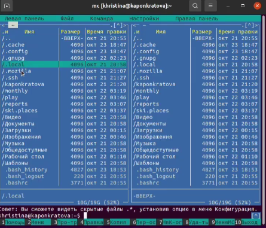
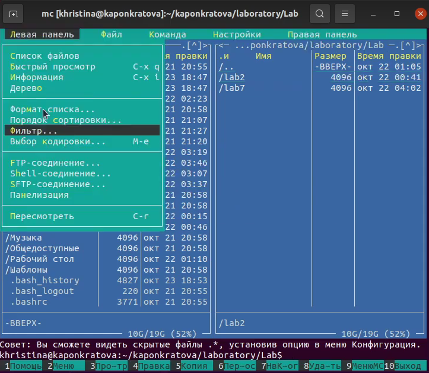
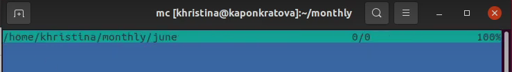
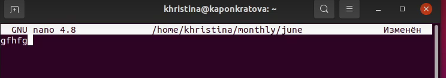
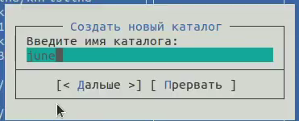
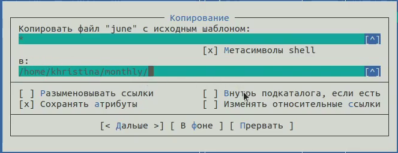
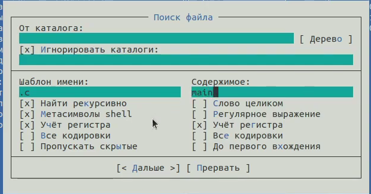
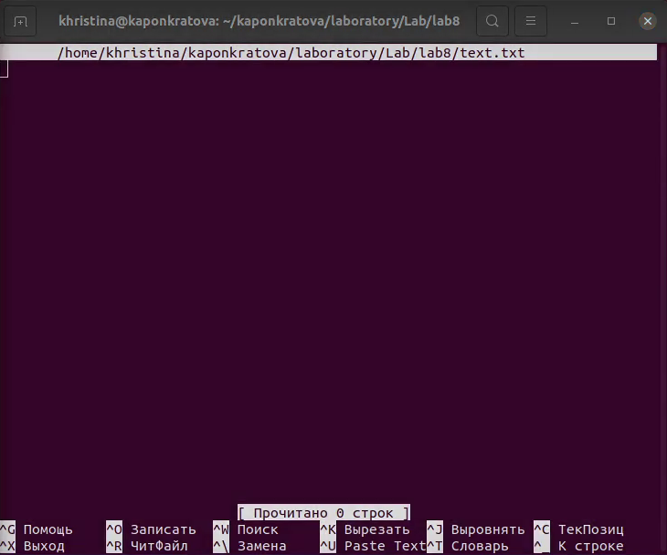
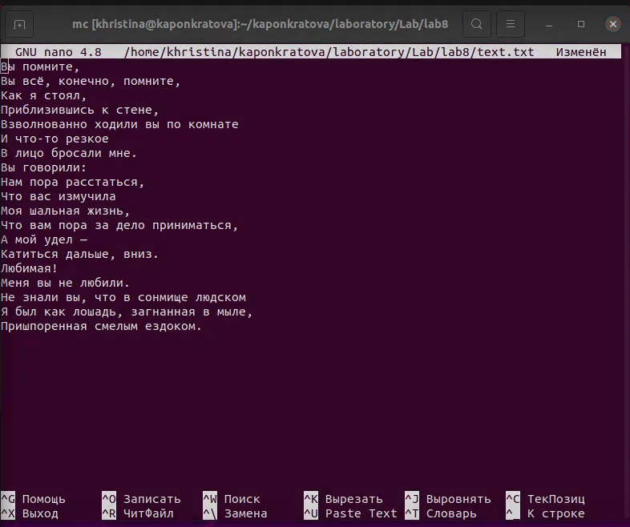


**РОССИЙСКИЙ УНИВЕРСИТЕТ ДРУЖБЫ НАРОДОВ**

**Факультет физико-математических и естественных наук**

**Кафедра прикладной информатики и теории вероятностей**

**ОТЧЕТ**

**ПО ЛАБОРАТОРНОЙ РАБОТЕ № 7**

*дисциплина: Операционные системы*

Студент: Понкратова Христина Анатольевна

Группа: НПМбд-02-20

МОСКВА

2021 г.

Цель работы:

Освоить основные возможности командной оболочки Midnight Commander. А также приобрести навыки практической работы по просмотру каталогов и файлов, манипуляций с ними.

Ход работы:

Задание по МС:

\1. Изучаю информацию о mc, вызвав в командной строке man mc.

\2. Запускаю, изучаю его структуру и меню.

\3. Выполняю несколько операций в mc, используя управляющие клавиши

(операции с панелями; выделение/отмена выделения файлов, копирование/перемещение файлов, получение информации о размере и правах доступа на файлы и/или каталоги и т.п.).

\4. Выполняю основные команды меню левой и правой панелей. Оцениваю степень подробности вывода информации о файлах.

\5. Используя возможности подменю «Файл» выполняю:

– просмотр содержимого текстового файла;

– редактирование содержимого текстового файла ;

– создание каталога;

– копирование файлов в созданный каталог.

\6. С помощью соответствующих средств подменю «Команда» осуществляю:

– поиск в файловой системе файла с заданными условиями (имя файла начинается с lab);

– выбор и повторение одной из предыдущих команд; 

– переход в домашний каталог;

– анализ файла меню и файла расширений.

\7. Вызываю подменю «Настройки» и осваиваю операции, определяющие структуру экрана mc.

Задание по встроенному редактору МС:

\1. Создаю текстовой файл text.txt.

\2. Открываю этот файл с помощью встроенного в mc редактора.

\3. Вставляю в открытый файл небольшой фрагмент текста.

\4. Проделываю с текстом следующие манипуляции, используя горячие клавиши:

4.1. Удалить строку текста.

4.2. Выделить фрагмент текста и скопировать его на новую строку.

4.3. Выделить фрагмент текста и перенести его на новую строку.

4.4. Сохранить файл.

4.5. Отменить последнее действие

4.6. Перейти в конец файла (нажав комбинацию клавиш) и написать текст.

4.7. Перейти в начало файла (нажав комбинацию клавиш) и написать текст.

4.8. Сохранить и закрыть файл.

\5. Открываю файл с исходным текстом на языке программирования С++

\6. Используя меню редактора, выключаю подсветку синтаксиса, так как изначально она была включена.

Вывод:

В ходе работы я освоила основные возможности командной оболочки Midnight Commander и приобрели навыки практической работы по просмотру каталогов и файлов; манипуляций с ними.

Ответы на контрольные вопросы:

\1. mc - визуальная файловая оболочка для UNIX/Linux систем, аналог Far, NortonCommander. На языке командной оболочки можно писать небольшие программы для выполнения ряда последовательных операций с файлами и содержащимися в них данными. Команда «Переставить панели» (Ctrl+U) меняет местами содержимое правой и левой панелей. Команда «Отключить панели» (Ctrl+O). По команде «Сравнить каталоги» (Ctrl-X,D) сравнивается содержимое каталогов, отображаемых на левой и правой панелях. Помимо того, что может

задаваться формат вывода на панель списка файлов, любую панель можно перевести в один из следующих режимов.

· Режим "Информация". В этом режиме на панель выводится информация о подсвеченном в другой панели файле и о текущей файловой системе.

· Режим "Дерево". В режиме отображения дерева каталогов в одной из панелей выводится графическое изображение структуры дерева каталогов. Этот режим подобен тому, который вы увидите, выбрав команду Дерево каталогов из меню Команды, только в последнем случае изображение структуры каталогов выводится в отдельное окно. Левая Панель и Правая Панель меню (левой/правой панели) позволяют оперировать режимами отображения панелей.

\2. Выполнение команд ОС UNIX из mc.

F1- Вызывает контекстно-зависимую подсказку

F2 - Вызывает меню, создаваемое пользователем. Оно позволяет создавать и добавлять дополнительные функции.

F3 - Просмотр файла, на который указывает подсветка в активной панели

F4 - Вызов встроенного редактора для файла, на который указывает подсветка в активной панели

F5- Копирование файла или группы отмеченных файлов из каталога, отображаемого в активной панели, в каталог, отображаемый на второй панели. При копировании одного файла можно поменять его имя. Можно также указать имя каталога, куда будет производиться копирование

F6 - Перенос файла или группы отмеченных файлов из каталога, отображаемого в активной панели, в каталог, отображаемый на второй панели. Как и при копировании, можно поменять имя файла или целого каталога.

F7 - Создание подкаталога в каталоге, отображаемом в активной панели

F8- Удаление файла (подкаталога) или группы отмеченных файлов

F9 - Вызов основного меню программы (отображаемого над панелями)

F10 - Выход из программы.

\3. Подпункты меню левой панели:

· Список файлов показывает файлы в домашнем каталоге.

· Быстрый просмотр позволяет выполнить быстрый просмотр содержимого панели.

· Информация позволяет посмотреть информацию о файле или каталоге

· Командная оболочка Midnight Commander В меню каждой (левой или правой) панели можно выбрать Формат списка: стандартный, ускоренный, расширенный и определённый пользователем.

· Порядок сортировки позволяет задать критерии сортировки при выводе списка файлов и каталогов: без сортировки, по имени, расширенный, время правки, время доступа, время изменения атрибута, размер, узел.

\4. Подпункты меню «файл»:

· Просмотр ( F3 ) позволяет посмотреть содержимое текущего файла без возможности редактирования.

· Просмотр вывода команды ( М + ! ) функция запроса команды с параметрами.

· Правка ( F4 ) открывает текущий (или выделенный) файл для его редактирования.

· Копирование ( F5 ) осуществляет копирование одного или нескольких файлов или каталогов в указанное пользователем во всплывающем окне место.

· Права доступа ( Ctrl-x c ) позволяет изменить права доступа к одному или нескольким файлам или каталогам.

· Права доступа на файлы и каталоги

· Жёсткая ссылка ( Ctrl-x l ) позволяет создать жёсткую ссылку к текущему (или выделенному) файлу1 .

· Символическая ссылка ( Ctrl-x s ) — позволяет создать символическую ссылку к текущему файлу .

· Владелец группы ( Ctrl-x o ) позволяет задать владельца и имя группы для одного или нескольких файлов или каталогов.

· Права (расширенные) позволяет изменить права доступа и владения для одного или нескольких файлов или каталогов.

· Переименование ( F6 ) позволяет переименовать один или несколько файлов или каталогов.

· Создание каталога ( F7 ) позволяет создать каталог.

· Удалить ( F8 ) позволяет удалить один или несколько файлов или каталогов.

· Выход ( F10 ) завершает работу mc.

\5. Подпункты меню «команда»:

· Дерево каталогов отображает структуру каталогов системы.

· Поиск файла выполняет поиск файлов по заданным параметрам.

· Переставить панели меняет местами левую и правую панели.

· Сравнить каталоги ( Ctrl-x d ) сравнивает содержимое двух каталогов.

· Размеры каталогов отображает размер и время изменения каталога (по умолчанию в mc размер каталога корректно не отображается).

· История командной строки выводит на экран список ранее выполненных в оболочке команд.

· Каталоги быстрого доступа ( Ctrl-\ ) при вызове выполняется быстрая смена текущего каталога на один из заданного списка.

· Восстановление файлов позволяет восстановить файлы на файловых системах ext2 и ext3.

· Редактировать файл расширений позволяет задать с помощью определённого синтаксиса действия при запуске файлов с определённым расширением (например, какое программного обеспечение запускать для открытия или редактирования файлов с расширением .c или .cpp).

· Редактировать файл меню позволяет отредактировать контекстное меню пользователя, вызываемое по клавише F2 .

· Редактировать файл расцветки имён позволяет подобрать оптимальную для пользователя расцветку имён файлов в зависимости от их типа.

\6. Подпункты меню «настройки»:

· Конфигурация позволяет скорректировать настройки работы с панелями.

· Внешний вид и Настройки панелей определяет элементы, отображаемые при вызове mc, а также цветовое выделение.

· Биты символов задаёт формат обработки информации локальным терминалом.

· Подтверждение позволяет установить или убрать вывод окна с запросом подтверждения действий при операциях удаления и перезаписи файлов, а также при выходе из программы.

· Распознание клавиш диалоговое окно используется для тестирования функциональных клавиш, клавиш управления курсором и прочее.

· Виртуальные ФС настройки виртуальной файловой системы: тайм-аут, пароль и прочее.

\7. Встроенные команды mc:

· F1 - Вызов контекстно-зависимой подсказки.

· F2 - Вызов пользовательского меню с возможностью создания and/or.

· F3 - Просмотр содержимого файла, на который указывает подсветка в активной панели.

· F4 - Вызов встроенного в mc редактора для изменения содержания файла, на который указывает подсветка в активной панели.

· F5 - Копирование одного или нескольких файлов, отмеченных в первой (активной) панели, в каталог, отображаемый на второй панели.

· F6 - Перенос одного или нескольких файлов, отмеченных в первой панели, в каталог, отображаемый на второй панели.

· F7 - Создание подкаталога в каталоге, отображаемом в активной панели.

· F8 - Удаление одного или нескольких файлов, отмеченных в первой панели файлов.

· F9 - Вызов меню mc.

· F10 - Выход из mc.

\8. Команды mc :

· Ctrl+y удалить строку.

· Ctrl+u отмена последней операции.

· Ins вставка/замена.

· F7 поиск.

· Shift+F7 повтор последней операции поиска.

· F4 замена файла.

· F3 первое нажатие начало выделения, второе это окончание выделения.

· F5 копировать выделенный фрагмент F6 переместить выделенный фрагмент.

· F8 удалить выделенный фрагмент.

· F2 записать изменения в файл.

· F10 выйти из редактора.

\9. Один из четырех форматов списка в Midnight Commander –пользовательский, определённый самим пользователем позволяет ему редактировать меню любого из двух списков. А меню пользователя – это меню, состоящее из команд, определенных пользователем. При вызове меню используется файл ~/.mc.menu. Если такого файла нет, то по умолчанию используется системный файл меню /usr/lib/mc/mc.menu. Все строки в этих файлах, начинающиеся с пробела или табуляции, являются командами, которые выполняются при выборе записи.

\10. Когда мы выделяем файл не являющегося исполняемым, Midnight Commander сравнивает расширение выбранного файла с расширениями, прописанными в «файле расширений» ~/mc.ext. Если в файле расширений найдется подраздел, задающий процедуры обработки файлов с данным расширением, то обработка файла производится в соответствии с заданными в этом подразделе командами и файлами:

· файл помощи для MC. /usr/lib/mc.hlp

· файл расширений, используемый по умолчанию. /usr/lib/mc/mc.ext

· файл расширений, конфигурации редактора. $HOME/.mc.ext

· системный инициализационный файл. /usr/lib/mc/mc.ini

· фаил который содержит основные установки. /usr/lib/mc/mc.lib

· инициализационный файл пользователя. Если он существует, то системный файл mc.ini игнорируется. $HOME/.mc.ini

· этот файл содержит подсказки, отображаемые в нижней части экрана. /usr/lib/mc/mc.hint

· системный файл меню MC, используемый по умолчанию. /usr/lib/mc/mc.menu

· файл меню пользователя. Если он существует, то системный файл меню игнорируется. $HOME/.mc.menu

· инициализационный файл пользователя. Если он существует, то системный файл mc.ini игнорируется. $HOME/.mc.tree

