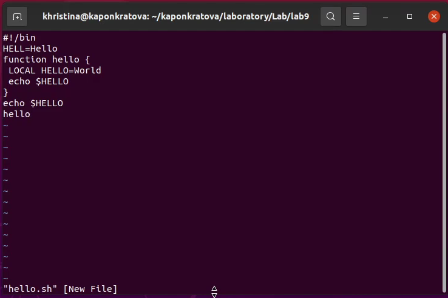
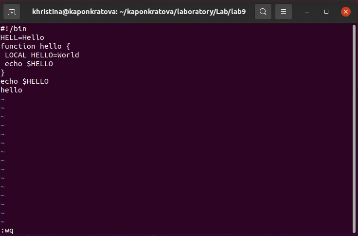
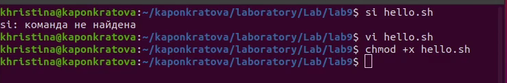
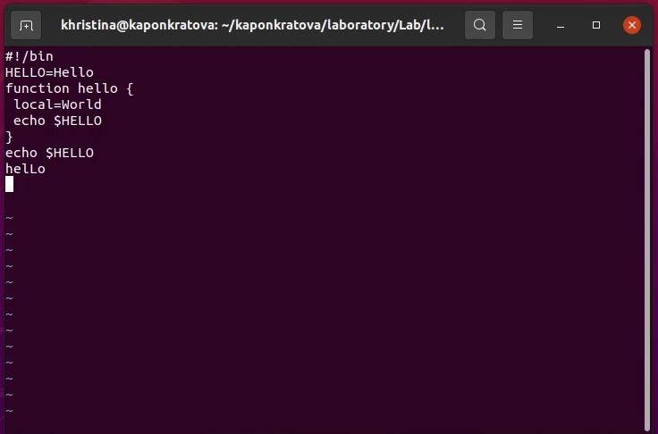

**РОССИЙСКИЙ УНИВЕРСИТЕТ ДРУЖБЫ НАРОДОВ**

**Факультет физико-математических и естественных наук**

**Кафедра прикладной информатики и теории вероятностей**

**ОТЧЕТ** 

**ПО ЛАБОРАТОРНОЙ РАБОТЕ № 9**

*дисциплина:	Операционные системы*		 

Студент:  Понкратова Христина Анатольевна

`	`Группа: НПМбд-02-20                                       

**МОСКВА**

2021 г.
# Цель работы:
Познакомиться с операционной системой Linux. Получить практические навыки работы с редактором vi, установленным по умолчанию практически во всех дистрибутивах.
# Ход работы:
## Задание № 1. Создание нового файла с использованием vi.
1. Создаю каталог с именем ~/kaponkratova/laboratory/Lab/lab9. 

1. Перехожу во вновь созданный каталог.

1. Вызываю vi и создаю файл hello.sh vi hello.sh.

1. Нажимаю клавишу «i» и ввожу следующий текст:

#!/bin/bash

HELL=Hello

function hello {

LOCAL HELLO=World

echo $HELLO

}

echo $HELLO

hello

1. Нажимаю клавишу «Esc» для перехода в командный режим после завершения ввода текста.

1. Нажимаю «:» для перехода в режим последней строки и внизу моего экрана появдяется приглашение в виде двоеточия. 
1. Нажимаю «w» и «q», а затем нажимаю клавишу «Enter» для сохранения нашего текста и завершения работы.

1. Делаю файл исполняемым, вызвав команду «chmod +x hello.sh».

## Задание 2. Редактирование существующего файла
1. Вызываю vi на редактирование файла, команда: «vi ~/kaponkratova/laboratory/Lab/lab9/hello.sh».

1. Устанавливаю курсор в конец слова HELL второй строки. 

1. Перехожу в режим вставки и заменяю на HELLO. Нажимаю «Esc» для возврата в командный режим.

1. Устанавливаю курсор на четвертую строку и стерли слово LOCAL. 

1. Перехожу в режим вставки и набрали: «local»; нажимаю «Esc» для возврата в командный режим. 

1. Устанавливаю курсор на последней строке файла. Вставляю после неё строку, содержащую «echo $HELLO». 
1. Нажимаю «Esc» для перехода в командный режим.
1. Удаляю последнюю строку. 
1. Ввожу команду отмены изменений «u» для отмены последней команды.
1. Ввожу символ «:» для перехода в режим последней строки. Записываю произведённые изменения и выхожу из vi.

# Вывод:
В ходе работы я познакомилась с операционной системой Linux и получила практические навыки работы с редактором vi, установленным по умолчанию практически во всех дистрибутивах.

# Ответы на контрольные вопросы:
1. *Командный режим* позволяет управлять курсором и вводить команды редактирования. 

*Режим вставки* допускает производить ввод текста. При этом текст не будет восприниматься, как команды редактирования. 

*Режим последней строки* позволяет производить запись файла на диск и выходить из редактора vi. Кроме того, используя этот режим, можно вводить дополнительные команды редактирования.

1. Если необходимо просто выйти из vi (без сохранения выполненных изменений), то необходимо в последней строке набрать символ q (или q!).
1. Команды позиционирования:

0 (ноль) - перейти в начало строки;

$ - перейти в конец строки;

G - перейти в конец файла;

nG - перейти на строку номер n.

1. Редактор vi предполагает, что слово - это строка символов, которая может включать в себя буквы, цифры и символы подчеркивания.
1. 0 (ноль) - перейти в начало строки;

$ - перейти в конец строки.

1. *Добавление / вставка текста*

«а» - добавить текст после курсора;

«А» - добавить текст в конец строки;

«i» - вставить текст перед курсором;

«ni» - вставить текст n раз;

«I» - вставить текст в начало строки.

*Вставка строки*

«o» -вставить строку под курсором;

«О» - вставить строку над курсором.

*Удаление текста*

«x» - удалить один символ в буфер;

«dw» - удалить одно слово в буфер;

«d$» - удалить в буфер текст от курсора до конца строки;

«d0» (ноль) - удалить в буфер текст от начала строки до позиции курсора;

«dd» - удалить в буфер одну строку;

«10dd» - удалить в буфер 10 строк.

*Отмена и повтор произведенных изменений*

«u» - отменить последнее изменение;

«.» - повторить последнее изменение.

*Копирование текста в буфер*

«Y» - скопировать строку в буфер;

«nY» - скопировать n строк в буфер;

«yw» - скопировать слово в буфер;

*Вставка текста из буфера*

«p» - вставить текст из буфера после курсора;

«P» - вставить текст из буфера перед курсором.

*Замена текста*

«cw» - заменить слово;

«n cw» - заменить n слов;

«c$» - заменить текст от курсора до конца строки;

«r» - заменить слово;

«R» - заменить текст.

*Поиск текста*

«/ <текст>» - произвести поиск вперед по тексту указанной строки символов <текст>;

«? <текст>» - произвести поиск назад по тексту указанной строки символов <текст>.

1. «c$» - заменить текст от курсора до конца строки.
1. «u» - отменить последнее изменение.
1. *Копирование и перемещение текста*

«:n,m d» - уничтожить строки с n по m, пример: «: 3,8d»;

«: i,j m k» - переместить строки с i по j , начиная со строки k, пример: «: 4,9m12»;

«: i,j t k» - копировать строки с i по j на строку k, пример: «: 2,5 t 13»;

«: i,j w <имя\_файла>» - записать строки с i по j в файл с именем <имя\_файла>, пример: «: 5,9 <имя \_файла>»;

*Запись в файл и выход из редактора*

«:w» - записать измененный текст в файл на диске, не выходя из Vi;

«:w <newfile>» - записать измененный текст в новый файл с именем <newfile>;

«:w! <имя\_файла>» - записать измененный текст в файл с именем<имя\_файла> ; 

«:wq» - записать изменения в файл и выйти из Vi;

«:q» - выйти из редактора Vi;

«:q!» - выйти из редактора без записи;

«:e!» - вернуться в командный режим, отменив все изменения, произведенные со времени последней записи.

1. $ - перемещает курсор в конец строки.
1. Опции редактора Vi позволяют настроить рабочую среду. Для задания опций используется команда set (в режиме последней строки):

«: set all» - вывести полный список опций;

«: set nu» - вывести номера строк;

«: set list» - вывести невидимые символы;

«: set ic» - не учитывать при поиске, является ли символ прописным или строчным.

1. Нажатие клавиши ESC всегда переводит Vi в командный режим (это удобно, когда вы точно не помните в каком режиме находитесь). Если вы нажмете клавишу ESC, находясь в командном режиме, машина напомнит вам об этом, подав звуковой сигнал.
1. Командный –>вставки– >последняя строка (командная строка).

